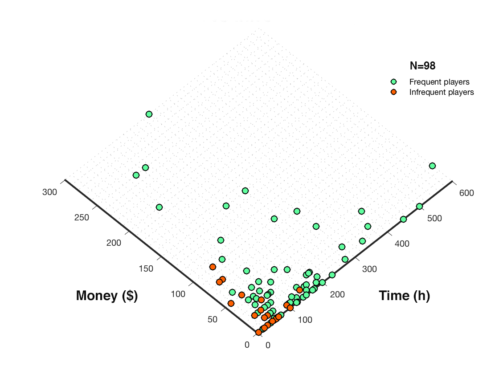

# Introduction

Artifact is a digital card game developed by Valve and released on November 28th, 2018. Despite the initial excitement of online gaming communities and internet personalities, the innovative mechanics and the depth of its strategic aspects, Artifct launch was a big flop. The player numbers started to dramatically drop following the game release, and Artifact reputation became controversial. As a consequence many streamers, youtubers and professional players decided not to commit time and resources in a game that was clearly not attracting enough interest. 
According to the most popular opininons, Artifact insuccess seems to be driven by a combination of factors:
- The lack of a proper ladder and rewards;
- The monetization system requires to pay to obtain cards and access the most competitive game modalities;
- The game price is 20$.

     

  <i>Wordclouds of the most common negative (left) and positive (right) aspects of Artifact</i> 

I tried to follow the development of these and other opinions from their early formulations to the point they became inflated memes and shitposting actions on Reddit, Twitter and Twitch, realizing that the reasons behind the game insuccess might be more complex than "just" its price, monetization and reward system. 
Is it possible that people simply don't like playing the game? Could it be that it is just boring or not engaging enough? And if so, what is actually wrong with the game? 
On this page you will find the outcome of a spontaneous and independent survey contucted on r/Artifact with the goal of exploring how players approach Artifact, how they feel when playing the game, how often they play it and what they like/dislike about it.

## The Artifact player experience survey 

The survey consisted of 5 sections: the first was to collect demographic information, such as how often people play the game and which game modality, to contextualize the subsequent game evaluation. The second, third and fourth sections included a total of 70 items adapted from the Game Experience Questionnaire (GEQ - IJsselsteijn, de Kort & Poels, 2013) and the MEEGA+ questionnaires (Petri, Gresse von Wangenheim, Borgatto, 2018), that have been previously used to evaluate gaming experience in various contexts. These consistituted the quantitative part of the game experience evaluation. Finally the last section aimed at collecting qualitative information, by asking participants to list 3 positive and negative aspects related to Artifact.

### Artifact experience in 15 dimensions

The Items of the quantitative sections were rated by participants on a scale from 1 (not at all) to 5 (extremely) and grouped into 15 dimensions, 11 were directly related to the immediate game experience:

- **Immersion.**  The player interest in the game story/lore, the involvement with the game elements and the possibility of being creative and imaginative while playing.
- **Flow.** If you ever had the feeling of being so focused on something that you lost the sense of time, then you were experiencing flow. This is an important aspect of the gaming experience as it is related with an intrinsic motivation to play.
- **Positive Affect.** How fun and exciting is the game.
- **Satisfaction.** Feeling you are progressing due to your effort is an essential aspect of gaming. This feature tries to capture how strong is the player sense of achievement.  
- **Competence.** The sense of being skillful and succesfull in the game.
- **Challenge.** It's related to the game difficulty, the time pressure and the effort required to play.
- **Annoyance.** A high score in this dimension indicates that a great sense of tension, frustration and nervousness characterised the gaming experience. 
- **Negative Affect.** The bad feelings of the player such as boredom, bad mood and low engagement.
- **Learnabity.** Measures how easily one can start playing the game from scratch, how clear are the rules and the game mechanics. 
- **Aesthetics.** The exterior game's appearence: the graphics, the sound quality as well as the design of cards, boards, and interfaces. 
- **Social.** Does the game promote cooperation or interaction between players?

The remaining 4 were measuring game experience after-effects:

- **Negative Experience.** If you felt that playing the game was a waste of time, you felt bad and ashamed about it. 
- **Positive Experience.** How good was the overall gaming experience? A high score suggest that the game left you with feelings of satisfaction and accomplishments.
- **Tiredness.** The sense of exhaustion that can be experienced at the end of the play.
- **Return to Reality.** How strongly you were thinking about the game afterwards and how hard it was to come back to reality.

## A closer look at the participants sample

 The global sample of the respondents consisted of 105 players. Among these, 3 didn't complete all the sections of the survey and 2 explicitly claimed they never played Artifact. These respondents were excluded from the analysis, leading to a sample of 98 participants (2 female, mean age = 27.9 ± 6.5).
The first thing we want to check is our players gaming background. Not surprisingly a large proportion mentioned Dota2, Hearthstone and Mtg/Mtga as games they regularly play. These are indeed the popular games more closely related to Artifact in terms of lore, gametype or developers. Alltogether 65% of the sample play card games and quite interestingly, nearly 25% mentioned the two FPS which follow the top 3 on the chart: Overwatch and CS:GO. 

 

<table>
  <tr>
    <th>Game:</th>
    <td>Dota2</td>
    <td>Hearthstone</td>
    <td>Magic/Mtga</td>
    <td>Overwatch</td>
    <td>CS:GO</td>
    <td>Gwent</td>
    <td>Starcraft</td>
    <td>WoW</td>
    <td>Slay the Spire</td>
    <td>LoL</td>
    <td>Eternal</td>
    <td>TESL</td>
    <td>Autochess</td>
    <td>Faeria</td>
  </tr>
  <tr>
    <th>% of players:</th>
    <td>39.3</td>
    <td>26.6</td>
    <td>19.1</td>
    <td>13.8</td>
    <td>9.5</td>
    <td>8.5</td>
    <td>7.4</td>
    <td>4.2</td>
    <td>4.2</td>
    <td>3.1</td>
    <td>3.1</td>
    <td>3.1</td>
    <td>3.1</td>
    <td>2.1</td>
  </tr>
</table>
  

 As one of the current issue of Artifact seems to be the low concurrent player numbers, let's have a look at how often our participant actually play the game compared to other games. 
 
 

  

The pattern of playfrequency appears quite different for Artifact vs other games. More than 95% of the sample frequently (daily or weekly) plays digital games whereas only 75% frequently play Artifact. Before examining the potential differences between these two subgroups, I want to first show the most played Artifact game modalities by pooling data from the global sample. 

  

Respondents where asked to indicate their most played Artifact game modality. They were allowed to indicate only one preference. I decided to group together the categories Draft tournaments and Constructed tournaments because of the low amount of responses.

## Two types of Artifact player

  

  <i>Resources invested in artifact</i> 
I posted the survey on r/Artifact and invited users who played at least 6h since the launch of the game.
