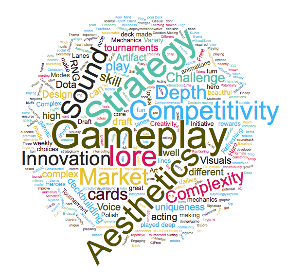

# Introduction

Artifact is a digital card game developed by Valve and released on November 28th, 2018. Despite the initial excitement of online gaming communities and internet personalities, the innovative mechanics and the depth of its strategic aspects, Artifct launch was a big flop. The player numbers started to dramatically drop following the game release, and Artifact reputation became controversial. As a consequence many streamers, youtubers and professional players decided not to commit time and resources in a game that was clearly not attracting enough interest. 
According to the most popular opininons, Artifact insuccess seems to be driven by a combination of factors:
- The lack of a proper ladder and rewards;
- The monetization system requires to pay to obtain cards and access the most competitive game modalities;
- The game price is 20$.

     

  <i>Wordclouds of the most common negative (left) and positive (right) aspects of Artifact. Data collected from the survey's qualitative section</i> 

I tried to follow the development of these complaints and other opinions from their early formulations to the point they became inflated memes and shitposting actions on Reddit, Twitter and Twitch, realizing that the reasons behind the game insuccess might be more complex than "just" its price, monetization and reward system. 
Is it possible that people simply don't like playing the game? Could it be that it is just boring or not engaging enough? And if so, what is actually wrong with the game? 
On this page you will find the outcome of a spontaneous and independent survey contucted on r/Artifact with the goal of exploring how players approach Artifact, how they feel when playing the game, how often they play it and what they like/dislike about it.

## The Artifact player experience survey 

The survey consisted of 5 sections: the first was to collect demographic information, such as how often people play the game and which game modality, to contextualize the subsequent game evaluation. The second, third and fourth sections included a total of 70 items adapted from the Game Experience Questionnaire (GEQ - IJsselsteijn, de Kort & Poels, 2013) and the MEEGA+ questionnaires (Petri, Gresse von Wangenheim, Borgatto, 2018), that have been previously used to evaluate gaming experience in various contexts. These consistituted the quantitative part of the game experience evaluation. Finally the last section aimed at collecting qualitative information, by asking participants to list 3 positive and negative aspects related to Artifact.

### Artifact experience in 15 dimensions

The Items of the quantitative sections were rated by participants on a scale from 1 (not at all) to 5 (extremely) and grouped into 15 dimensions, 11 were directly related to the immediate game experience:

- **Immersion.**  The player interest in the game story/lore, the involvement with the game elements and the possibility of being creative and imaginative while playing.
- **Flow.** If you ever had the feeling of being so focused on something that you lost the sense of time, then you were experiencing flow. This is an important aspect of the gaming experience as it is related with an intrinsic motivation to play.
- **Positive Affect.** How fun and exciting is the game.
- **Satisfaction.** Feeling you are progressing due to your effort is an essential aspect of gaming. This feature tries to capture how strong is the player sense of achievement.  
- **Competence.** The sense of being skillful and succesfull in the game.
- **Challenge.** It's related to the game difficulty, the time pressure and the effort required to play.
- **Annoyance.** A high score in this dimension indicates that a great sense of tension, frustration and nervousness characterised the gaming experience. 
- **Negative Affect.** The bad feelings of the player such as boredom, bad mood and low engagement.
- **Learnabity.** Measures how easily one can start playing the game from scratch, how clear are the rules and the game mechanics. 
- **Aesthetics.** The exterior game's appearence: the graphics, the sound quality as well as the design of cards, boards, and interfaces. 
- **Social.** Does the game promote cooperation or interaction between players?

The remaining 4 dimensions were measuring game experience after-effects:

- **Negative Experience.** If you felt that playing the game was a waste of time, you felt bad and ashamed about it. 
- **Positive Experience.** How good was the overall gaming experience? A high score suggest that the game left you with feelings of satisfaction and accomplishments.
- **Tiredness.** The sense of exhaustion that can be experienced at the end of the play.
- **Return to Reality.** How strongly you were thinking about the game afterwards and how hard it was to come back to reality.

## A closer look at the participants sample

 The global sample of the respondents consisted of 105 players. Among these, 3 didn't complete all the sections of the survey and 4 explicitly claimed they never played Artifact. These respondents were excluded from the analysis, leading to a sample of 98 participants (2 female, mean age = 27.9 ± 6.5).
The first thing we want to check is our players gaming background. Not surprisingly a large proportion mentioned Dota2, Hearthstone and Mtg/Mtga as games they regularly play. These are indeed the popular games more closely related to Artifact in terms of lore, gametype or developers. Alltogether 65% of the sample play card games and quite interestingly, nearly 25% mentioned the two FPS which follow the top 3 on the chart: Overwatch and CS:GO. 

 

<table>
  <tr>
    <th>Game:</th>
    <td>Dota2</td>
    <td>Hearthstone</td>
    <td>Magic/Mtga</td>
    <td>Overwatch</td>
    <td>CS:GO</td>
    <td>Gwent</td>
    <td>Starcraft</td>
    <td>WoW</td>
    <td>Slay the Spire</td>
    <td>LoL</td>
    <td>Eternal</td>
    <td>TESL</td>
    <td>Autochess</td>
    <td>Faeria</td>
  </tr>
  <tr>
    <th>% of players:</th>
    <td>39.3</td>
    <td>26.6</td>
    <td>19.1</td>
    <td>13.8</td>
    <td>9.5</td>
    <td>8.5</td>
    <td>7.4</td>
    <td>4.2</td>
    <td>4.2</td>
    <td>3.1</td>
    <td>3.1</td>
    <td>3.1</td>
    <td>3.1</td>
    <td>2.1</td>
  </tr>
</table>
  

 As one of the current issue of Artifact seems to be the low concurrent player numbers, let's have a look at how often our participant actually play the game compared to other games. 
 
 

  

The pattern of play-frequency appears quite different for Artifact vs other games. More than 95% of the sample frequently (daily or weekly) plays digital games whereas only 75% frequently play Artifact. Before examining the potential differences between these two subgroups, I want to first show the most played Artifact game modalities by pooling data from the global sample. 

  

Respondents where asked to indicate their most played Artifact game modality. They were allowed to indicate only one preference. I decided to group together the categories Draft tournaments and Constructed tournaments because of the low amount of responses. The plot shows that the most played game modalities are expert phantom draft and casual draft, accounting for around 64% of the sample. Only a minority of people seems to be mainly active in constructed: around 21% of the participants considering all of the constructed formats.

### Two types of Artifact player
  

 Before we start looking at the outcome of the game evaluation, it's worth noting that the sample of participants could be split into at least two groups: the frequent and the infrequent players. This rough subdivision is interesting because it might capture the differences between player that are fully engaged and those that are not very engaged with the game.   
However, because of the small sample size and the unbalance between the groups (77 frequent and 21 infrequent), I decided not to run statistical tests to compare the two groups as it would not be very meaningful.

<table>
  <tr>
    <th>Group:</th>
    <td>Frequent players</td>
    <td>Infrequent players</td>
  </tr>
  <tr>
    <th>sample size:</th>
    <td>77</td>
    <td>21</td>
  </tr>
   <th>Mean amount of hours:</th>
    <td>113.8</td>
    <td>52.5</td>
  </tr>
    <tr>
     <th>Mean amount of money ($):</th>
    <td>62.7</td>
    <td>31.2</td>
      </tr>
</table>
Instead what I am going to show you in the following sections is the "ranking" of the features evaluated by the two subgroups. In this way it might be possible to have a general idea of the differences charachterizing the gaming experience of the two subgroups (without drawing any conclusion on the general population).

## Artifact experience evaluation

Participants rated the game experience on a scale from 1 (not at all) to 5 (extremely), the items of the core questionnaire were then grouped into 11 dimensions and the items of the post gaming questionnaire into 4. The mean ratings are shown here for the two subgroups and sorted in descendent order from top to bottom. The colors associated to each feature is the same in both charts to capture differences between the groups at a glance. 
 

  

 

There are some similarities and some striking differences in the ratings of the two groups. Starting from the top of the chart, aesthetics is the highest rated feture in both groups (4.3 frequent players and 3.7 infrquent players). All of the players consider the game exterior appearence, the sound, the cards and boards design to be beautiful. This is pretty much the only dimension in which the two group ratings are in strong agreement.  
As we look at the other two positions of the top 3, things start to diverge dramatically. The prevalent features for frequent players are satisfaction (4.1) and positive affect (3.8). For this group the sense of achievement coming from a victory, the feeling of progression due to personal effort and the fun of the game are prevalent aspects of the Artifact experience. They would totally recommend the game to a friend or a colleague. Quite the contrary for the group of infrequent players: they experience high levels of annoyance (3.6) and negative affect (3). This means that they feel tense and frustrated while playing the game. For them Artifact is not engaging and they are easily distracted or bored during a match.  
The 4th and 5th positions of the charts are occupied by competence and challenge, with competence being more dominant for the frequent players and challenge for the infrequent players. Competence is the sense of being skillful at the game whereas challenge is a measure for the game difficulty. 
It is worth mentioning that for both groups, Artifact learnability is relatively low, which means that the game rules are perceived as complex and not easy to grasp from the tutorial. Also worth noting that the social aspects of the game fill the bottom three chart for both groups. The game is not considered to be interactive or that cooperation and competition are not incentivized. 
Finally, while frequent player experience an average flow of around 3.5, for infrequent player this is one of the worst rated features (2.1). The sense of flow is the experience of deep concentration, dedication and engagement,  typical of someone enjoying a certain activity. It is related with an intrinsic motivation to perform that activity, which makes it inherently rewarding. 
 

 
The ratings are somewhat consistent for the section related to the Artifact experience after-effects.  
For the frequent players positive experience is the dominant feature (3.0), followed by tiredness (2.5) and negative experience (1.8). For infrequent players instead is tiredness being at the top of the chart (2.7) followed by negative experience (2.4) and positive experience (1.8). Both groups experience low levels of return to reality, which means that they don't think too much about the game after they stop playing, and don't feel disconnected with reality.

### Exploring the relationships between pattern of features
 

  

 
The previous section shows a ranking of the feature ratings made by the two subgroups of participants. This comparison is interesting by itself, as it shows the dominant elements charachterising player experiences. However it doesn't clarify what is important in defining the player positive or negative experience in the two groups. One approach to address this issue could be to run a regression analysis and observe which of the feature better predicts the rating in "positive experience" in the two groups. However, because the dimensions of the questionnaire are inherently correlated with each other, the importance of each feature in explaining "positive experience" would be hard ot interpret.

## Positive and negative aspects 

Finally coming to the last section of the survey, I asked participants to list 3 positive and negative aspects about Artifact.
Participants listed a very colorful variety of praises and complaints. In order to make sense out of them and compare the opinions of our two group of players, I decided to classify them in categories. 

>(A) Artifact has a lot of depth in its gameplay. This ensures a high skill ceiling and gives me opportunity to continuously improve. (B) Artifact caters to both rich and poor players as it has both well implemented Constructed and Draft formats. (C) Artifact feels premium. It has great UI, Soundtrack and Voice Acting.

I need to make some explicit remarks on how I categorized the opinions, as this is somewhat arbitrary. I created some pattern of

### Positive aspects

- Gameplay

Below you can find another chart with the ranking of the positive and negative Artifact opinions for frequent and infrequent player. The chart Y axis represent the percentage of player (within the group) that expressed an opinion falling in a specific category.

     

There is an incredible consistency in the pattern of positive aspects listed by both groups of player. Gameplay, strategy and aesthetics are at the top 3, followed by the lore, competitivity, sound effects, market and innovation.
Also regarding the negative aspects of the game, there seem to be a general agreement between frequent and infrequent players. Rewards, RNG and card balance are the top 3 are some discrepancies between the two groups. Frequent pla

